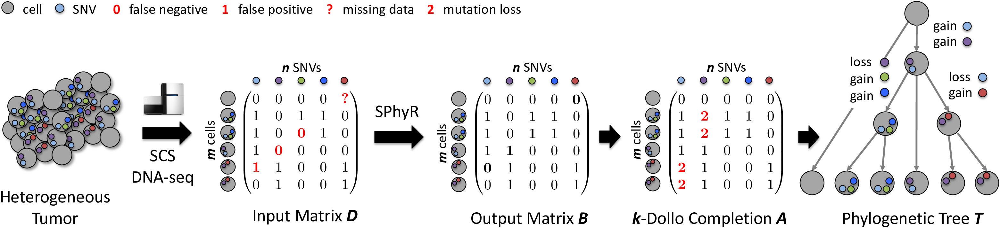

# SPhyR - Single-cell Phylogeny Reconstruction

SPhyR is an algorithm for reconstructing phylogenetic trees from
single-cell sequencing data. SPhyR employs the k-Dollo phylogeny model,
where each SNV can only be gained once but lost k times.

## Contents

  1. [Compilation instructions](#compilation)
     * [Dependencies](#dep)
     * [Compilation](#comp)
  2. [Usage instructions](#usage)
     * [I/O formats](#io)
     * [k-Dollo Phylogeny](#kDP)
     * [k-Dollo Phylogeny Flip and Cluster](#kDPFC)
     * [Solution Visualization (`visualize`)](#viz)

## Compilation instructions

### Dependencies

SPhyR is written in C++11 and thus requires a modern C++ compiler (GCC >= 4.8.1, or Clang). In addition, SPhyR has the following dependencies.

* [CMake](http://www.cmake.org/) (>= 2.8)
* [Boost](http://www.boost.org) (>= 1.38)
* [LEMON](http://lemon.cs.elte.hu/trac/lemon) graph library (>= 1.3)
* [CPlex](https://www.ibm.com/analytics/data-science/prescriptive-analytics/cplex-optimizer) (>= 12.7)

[Graphviz](http://www.graphviz.org) is required to visualize the resulting DOT files, but is not required for compilation.

In case [doxygen](http://www.stack.nl/~dimitri/doxygen/) is available, extended source code documentation will be generated.

### Compilation

To compile SPhyR, execute the following commands from the root of the repository:

    $ mkdir build
    $ cd build
    $ cmake ..
    $ make

In case CMake fails to detect LEMON, run the following command with adjusted paths:

    $ cmake -DLIBLEMON_ROOT=~/lemon 

The compilation results in the following files in the `build` directory:

EXECUTABLE | DESCRIPTION
-----------|-------------
`analyze`  | Computes various performance statistics of a solution.
`kDP`      | Solves the k-Dollo Phylogeny problem given a binary matrix B and integer k.
`kDPFC`    | Solves the k-Dollo Phylogeny Flip and Clsuter problem given a binary matrix with missing data, an integer k, a false positve rate alpha, a false negative rate beta, a number s of taxon clusters and number t of character clusters.
`perturb`  | Introduces false positives and false negatives in a given binary matrix.
`simulate` | Simulates a k-Dollo phylogenetic tree given a perfect phylogeny tree
`visualize`| Visualizes a phylogenetic treein Graphviz DOT format.

## Usage instructions

### I/O formats

SPhyR's input file is text based. The first line lists the number of taxa (cells), followed by the number of characters (SNVs) on the second line. Then, each subsequent line defines the value of each character for each taxon. More specifically, the allowed values are 0, 1 and -1, where 0 denotes the absence of the mutation, 1 denotes the presence of the mutation and -1 indicates missing data.

### k-Dollo Phylogeny (`kDP`)

In the k-Dollo Phylogeny problem, we are given a binary matrix `B` and integer `k`, and wish to determine whether there exists a k-Dollo phylogeny for `B`, and if so construct one.

    Usage:
      ./kDP [--help|-h|-help] [-M int] [-T int] [-k int] [-t int] [-v] input
         output
    Where:
      input
         Input file
      output
         Output file
      --help|-h|-help
         Print a short help message
      -M int
         Memory limit in MB (default: -1, unlimited)
      -T int
         Time limit in seconds (default: -1, unlimited)
      -k int
         Maximum number of losses per character (default: 1)
      -t int
         Number of threads (default: 1)
      -v
         Verbose output

An example execution:

    $ ./kDP -k 1 ../data/k_dollo/m25_n25_s7_k1_loss0.4.B > outputA.txt
    Step 1 -- elapsed time 0.00345898 s
    Step 1 -- number of constraints: 138
    Step 1 -- number of active variables: 54
    Step 1 -- introduced 3 constraints
    Step 2 -- elapsed time 0.00559616 s
    Step 2 -- number of constraints: 141
    Step 2 -- number of active variables: 58
    Step 2 -- introduced 0 constraints
    CPLEX: [2000 , 2000]
    Elapsed time: 0.013164

The file `outputA.txt` contains the k-Dollo completion.

### k-Dollo Phylogeny Flip and Cluster (`kDPFC`)

In the k-Dollo Phylogeny Flip and Cluster, we are given matrix `D`, error rates `alpha, beta`, integers `k, s, t`, and wish to find a binary matrix `A` and tree `T` such that: (1)~`B` has at most `s` unique rows and at most `t` unique columns; (2) \Pr(D \mid B, alpha, beta)$ is maximum; and (3) `T` is a k-Dollo phylogeny for `B`.

    Usage:
      ./kDPFC [--help|-h|-help] [-M int] [-N int] [-T int] [-a num] [-b num]
         [-k int] [-s int] [-t int] [-v] input output
    Where:
      input
         Input file
      output
         Output file
      --help|-h|-help
         Print a short help message
      -M int
         Memory limit in MB (default: -1, unlimited)
      -N int
         Number of restarts (default: 1)
      -T int
         Time limit in seconds (default: -1, unlimited).
      -a num
         False positive rate (default: 1e-3)
      -b num
         False negative rate (default: 0.3)
      -k int
         Maximum number of losses per SNV (default: 1)
      -s int
         Random number generator seed (default: 0)
      -t int
         Number of threads (default: 1)
      -v
         Verbose output

An example execution:

    $ ./kDPFC ../data/CRC/CRC1.input -a 0.0152 -b 0.0789 > CRC1.A
    Number of fixed characters = 0
    Number of fixed taxa = 0
    Base log likelihood = 0
    Step 1 -- elapsed time 0.020782 s
    Step 1 -- number of constraints: 150
    Step 1 -- number of active variables: 217
    ...

### Solution Visualization (`visualize`)

The `visualize` executable generates a tree in DOT format.

    Usage:
      ./visualize [--help|-h|-help] [-T] [-c str] [-t str] input
    Where:
      input
         Input file
      --help|-h|-help
         Print a short help message
      -T
         Use tree instead of matrix
      -c str
         Character labels
      -t str
         Taxon labels

An example execution:

    $ ./visualize CRC1.A -c ../data/CRC/CRC1_SNV.labels -t ../data/CRC/CRC1_cell.labels > CRC1.dot
    $ dot -Tpng CRC1.dot -o CRC.png
